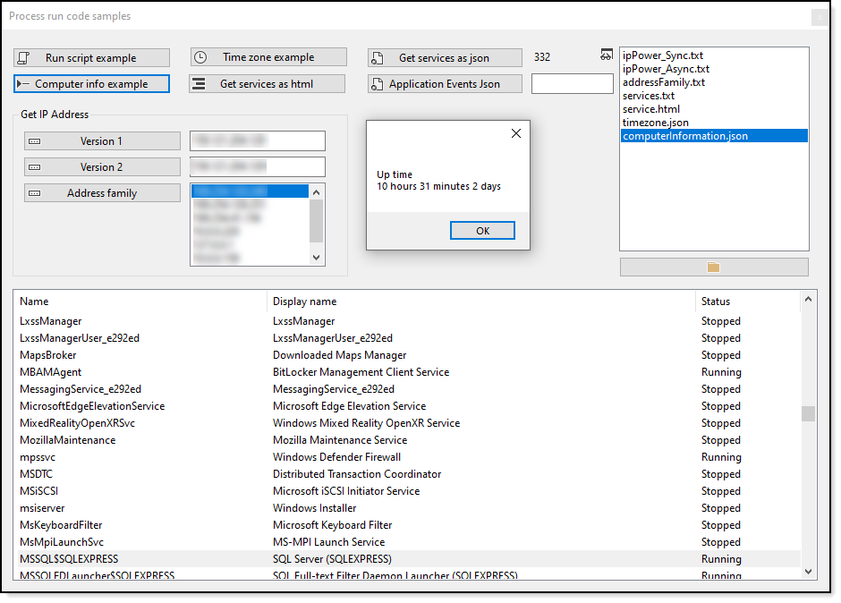

# About

This project shows how to run [PowerShell](https://docs.microsoft.com/en-us/powershell/) operations using Process without showing a window and will direct results to a text file followed by reading the text file for results.

In one case results are in Json which will be presented in a ListView while another example shows results in TextBox controls.


&nbsp;&nbsp;&nbsp;&nbsp;


# Requires


## NuGet packages

- [System.Text.Json](https://www.nuget.org/packages/System.Text.Json/6.0.0-preview.1.21102.12)
- [Newtonsoft.Json](https://www.nuget.org/packages/Newtonsoft.Json/12.0.3)
- [System.ServiceProcess.ServiceController](https://www.nuget.org/packages/System.ServiceProcess.ServiceController/6.0.0-preview.1.21102.12)

### Package notes

There are two different packages used to interact with json data. The System.Text.Json fails on specific date formats, otherwise one package would be needed and not have to use Newtonsoft.json which has been introduced for System.Text.Json failing on a date format when invoking Get-EventLog in regards to Timegenerated property.

```csharp
var yesterdayDate = DateTime.Now.AddDays(-1);

var start = new ProcessStartInfo
{
    FileName = "powershell.exe",
    RedirectStandardOutput = true,
    Arguments = $"Get-EventLog -LogName application -After {yesterdayDate:d} | Select-Object Category, Timegenerated, EntryType, Source, Message | ConvertTo-Json",
    CreateNoWindow = true
};
```

This format is not supported by System.Text.Json which is fairly new while Newtonsoft.json has been around for a long time and is the most used NuGet package on NuGet.
```json
"TimeGenerated":  "\/Date(1614873153000)\/",
```
# Screen

Changes as more code samples are added

