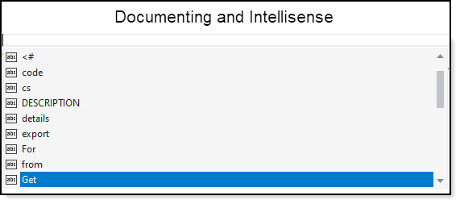

# About

Show how to use PowerShell with C# by calling via Process.Start. An alternate method is to use an NuGet package to reference PowerShell directly.

  

# Microsoft TechNet article

[Running PowerShell with C#](https://social.technet.microsoft.com/wiki/contents/articles/54294.running-powershell-with-c.aspx)

# Requires

This type of code can be used for utility applications. Note how code is setup there is no visible window to appear while without the proper setup a console window would appear.

- **ChromeLauncher** class provides access to open a web page in Chrome where Chrome is not in the path.
- **PowerShellOperations** class contains all operations dealing with PowerShell
- **ServiceItem** class is a concrete container for reading json

All code gets invoked from a Windows Form but could be called from a Console project.

- **Version 1** Get IP synchronously
- **Version 2** Get IP asynchronously
- **Application events json** Get application events one day back asynchronously timed
- **Application json** Get application one day back asynchronously into ListView with find and select.

# PowerShell version

- In Visual Studio, tools menu
- Select Command-line
- Select `Developers PowerShell`
- Type `Get-Host` or `(Get-Host).Version`

Or

`(Get-ItemProperty -Path HKLM:\SOFTWARE\Microsoft\PowerShell\3\PowerShellEngine -Name 'PowerShellVersion').PowerShellVersion`

Or

View menu, `Terminal` you can run PS commands too.

# Getting Started with the PowerShell Gallery

The [PowerShell Gallery](https://docs.microsoft.com/en-us/powershell/scripting/gallery/getting-started?view=powershell-7.1) is a package repository containing scripts, modules, and DSC resources you can download and leverage. You use the cmdlets in the PowerShellGet module to install packages from the PowerShell Gallery. You do not need to sign in to download items from the PowerShell Gallery.

# IntelliSense and documentation

